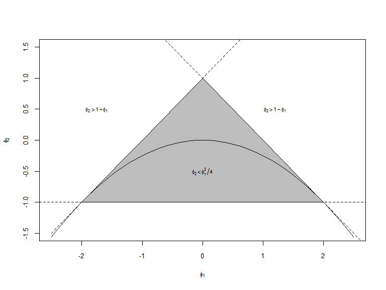

Stationarity of AR(2) process
================
Thiyanga Talagala
June 5, 2017

-   [Stationarity of AR(2) process](#stationarity-of-ar2-process)

Stationarity of AR(2) process
=============================

This code was extracted from <https://stats.stackexchange.com/questions/118019/a-proof-for-the-stationarity-of-an-ar2>.

``` r
phi1 <- seq(from = -2.5, to = 2.5, length = 51)
plot(phi1, 1 + phi1, lty = "dashed", type = "l", xlab = "", 
    ylab = "", cex.axis = 0.8, ylim = c(-1.5, 1.5))
abline(a = -1, b = 0, lty = "dashed")
abline(a = 1, b = -1, lty = "dashed")
title(ylab = expression(phi[2]), xlab = expression(phi[1]), 
    cex.lab = 0.8)
polygon(x = phi1[6:46], y = 1 - abs(phi1[6:46]), col = "gray")
lines(phi1, -phi1^2/4)
text(0, -0.5, expression(phi[2] < phi[1]^2/4), cex = 0.7)
text(1.2, 0.5, expression(phi[2] > 1 - phi[1]), cex = 0.7)
text(-1.75, 0.5, expression(phi[2] > 1 + phi[1]), cex = 0.7)
```


